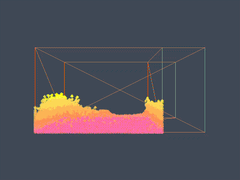

# PBF

## Goal

- Implement both the CPU and GPU version of the Position Based Fluid

## Current Progress

- [x] CPU impl
- [x] GPU impl
- [ ] Customizable particle system
- [ ] Fluid Rendering (not particle rendering)
- [ ] Code refactoring
- [ ] Optional build on GPU impl

## Some Images

Wave simulation using ~18,000 particles on NVIDIA GeForce GTX 960M.

OpenGL coordinate system reference

## Dependency

- OpenGL
- glfw3
- GLEW
- glm (header-only library)
- CUDA 8.0 (this should be optional)

## Project Setup

- All the third party dependency headers should be inside `C:\ThirdParty\Include`.
- All the third party dependency libraries should be inside `C:\ThirdParty\Libs`.

## References

- [Macklin, Miles, and Matthias Müller. "Position based fluids."](http://mmacklin.com/pbf_sig_preprint.pdf)
- [van der Laan, Wladimir J., Simon Green, and Miguel Sainz. "Screen space fluid rendering with curvature flow."](https://pdfs.semanticscholar.org/1986/5d92faa033632cc1c8ecf95d12a7400c34f1.pdf)
- ["Screen Space Fluid Rendering for Games", NVIDIA, GDC 2010](http://developer.download.nvidia.com/presentations/2010/gdc/Direct3D_Effects.pdf)
- ["Particle Simulation using CUDA", Simon Green](http://developer.download.nvidia.com/assets/cuda/files/particles.pdf)
- [Good OpenGL Tutorial for Beginners](https://learnopengl.com/)
- [Eisemann, Elmar, and Xavier Décoret. "Single-pass GPU solid voxelization for real-time applications."](http://maverick.inria.fr/Publications/2008/ED08a/solidvoxelizationAuthorVersion.pdf)